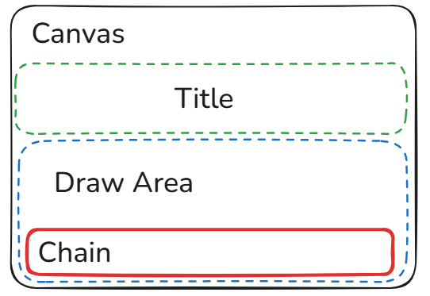
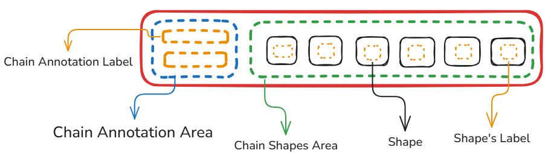
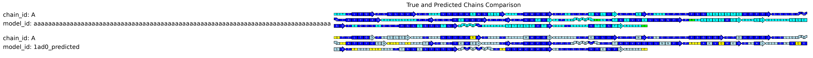

# Plot Structure

Hi there! 👋

This file describes the structure of the plot used to visualize the secondary structure of proteins.
The plot is essentially a kind of "matryoshka" (nesting doll) — it's composed of nested objects, each responsible for a specific part of the visualization: shapes, colors, labels, and so on.
If you ever decide to dive deeper into the source code of this project, especially the part responsible for plotting, this file should make it easier to understand how everything fits together.

## Table of Contents

- [Canvas](#canvas)  
- [Chain](#Chain) 

## Canvas

The **Canvas** is essentially the base layer — the field onto which all other components of the plot are stacked.
You can think of it as a kind of glue: it doesn't do much by itself, but without it, everything would fall apart. It holds the entire structure together and provides the surface for rendering all visual elements.
The Canvas contains two main components:
- **Title** – Just plot's title, nothing special.
- **DrawArea** – as you can see on the picture, the DrawArea is responsible for storing all the added chains and managing their alignment relative to one another. 
  In simple terms, it ensures that chains don’t overlap and are displayed in an organized way.
  
## Chain

Now we move on to the second major object responsible for the visualization: the **Chain**.
If the Canvas is the glue, then the Chain is the building block — the core unit that we stack and arrange to form a complete plot.

Each **Chain** is not a monolithic object either — just like the Canvas, it consists of two main subcomponents:
- **ChainAnnotationArea**
- **ChainShapesArea**
Both are responsible for managing specific types of data.

### ChainAnnotationArea

**ChainAnnotationArea** stores metadata about the chain — such as `model_id`, `algorithm`, and `chain_id`. This information is displayed as labels to the **left** of the ChainShapesArea.
You might wonder whether long labels could cause layout issues — don’t worry! The **DrawArea** keeps track of label widths and automatically aligns all Chains so that their graphical parts stay perfectly level, regardless of annotation length. (Check attached image)

### ChainShapesArea

The **ChainShapesArea** contains the actual **Shapes**, which are responsible for displaying the secondary structure of the protein.

As of now (April 22, 2025), there are four types of Shapes:
- **Helix**
- **Strand**
- **Other**
- **Gap**

The classification of secondary structure elements is handled by the algorithm used in the application.  
However, you can always customize this classification by providing your own dictionary of structure classes — and include any new Shape types you want.

Just keep in mind: if you introduce a new Shape, you'll also need to define **how it should be drawn** — otherwise, the visualization won’t know what to do with it.

You may also notice the **Shape's label** in the visualization — it typically shows the amino acid code.  
If needed, the display of this label (and others) can be turned off using configuration options.

